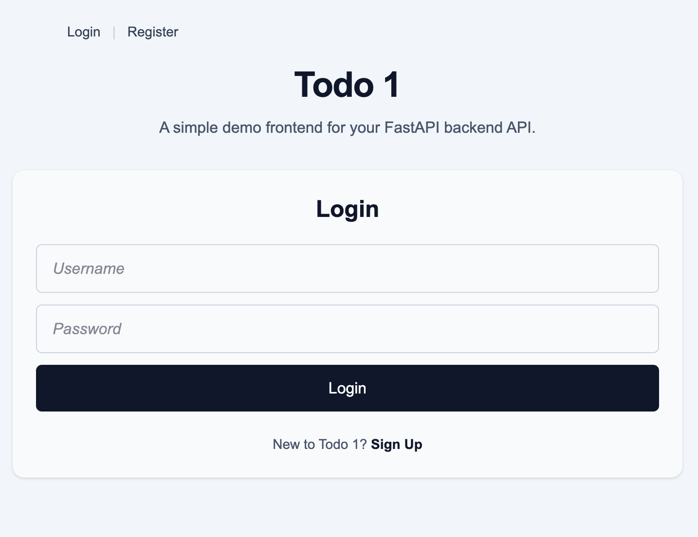
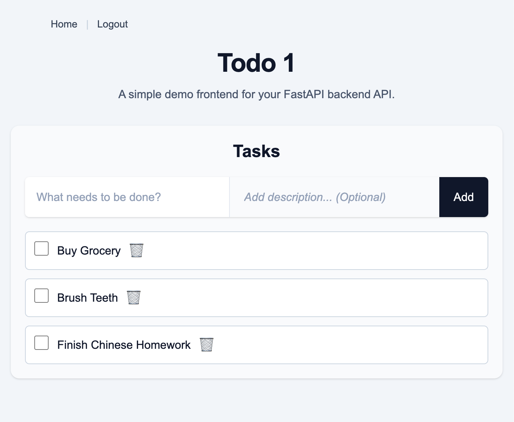
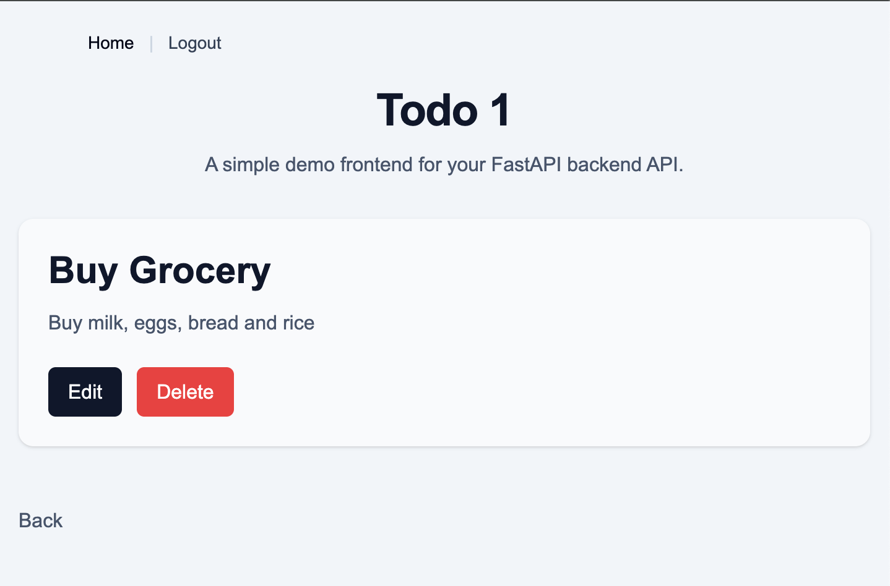

# ToDo 1

A full-stack task management web application built with FastAPI, React, PostgreSQL and deployed with Docker and AWS.

## Live Demo

Web App: https://todo1.app
Backend API Docs: https://todo1-fastapi.com/docs

## Features
- User registration and login
- JWT authentication
- Create, edit, complete, and delete tasks (Full CRUD)
- HTTPS-enabled deployment

## Tech Stack

### Backend
- FastAPI
- SQLModel
- PostgreSQL
- JWT Authentication

### Frontend
- React
- React Router
- Tailwind CSS

### Infrastructure
- Docker
- AWS EC2
- Amazon RDS
- Nginx
- Certbot
- Route 53
- Vercel

## Architecture
```text
React (Vercel)
        ↓
FastAPI API (EC2 + Docker + Nginx)
        ↓
PostgreSQL (Amazon RDS)
```
## Screenshots




## Running Locally

###
- Docker
- Docker Compose

### Setup

First, git clone this repo
```bash
git clone https://github.com/kotaroyama/ToDo-1.git
cd ToDo-1
```

Then obtain JWT secret key
```bash
openssl rand -base64 32
```

and paste it into .env as JWT_SECRET_KEY.
```bash
touch .env
```

After that, you should be able to run it with Docker.
```bash
docker compose up --build
```
Frontend should be up at: http://localhost
Backend at: http://localhost:8000

## Environment Variables

Backend:
- DATABASE_URL
- JWT_SECRET_KEY

Frontend:
- VITE_API_URL

## Future Improvements

- More testing
- CI/CD pipeline
- Alembic migrations
- Reset password feature

## What I Learned
- Dockerizing a full-stack web app
- Deploying FastAPI backend API on AWS EC2
- Frontend/backend integration and CORS